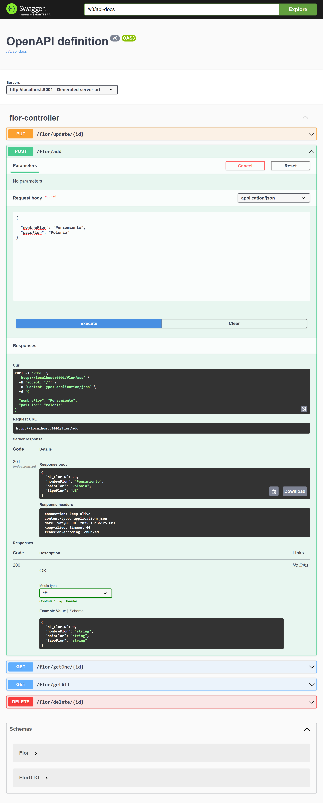
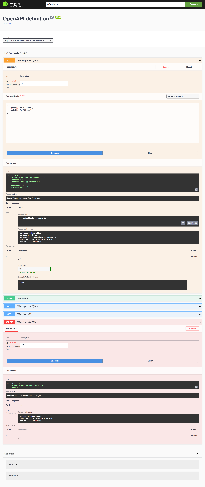
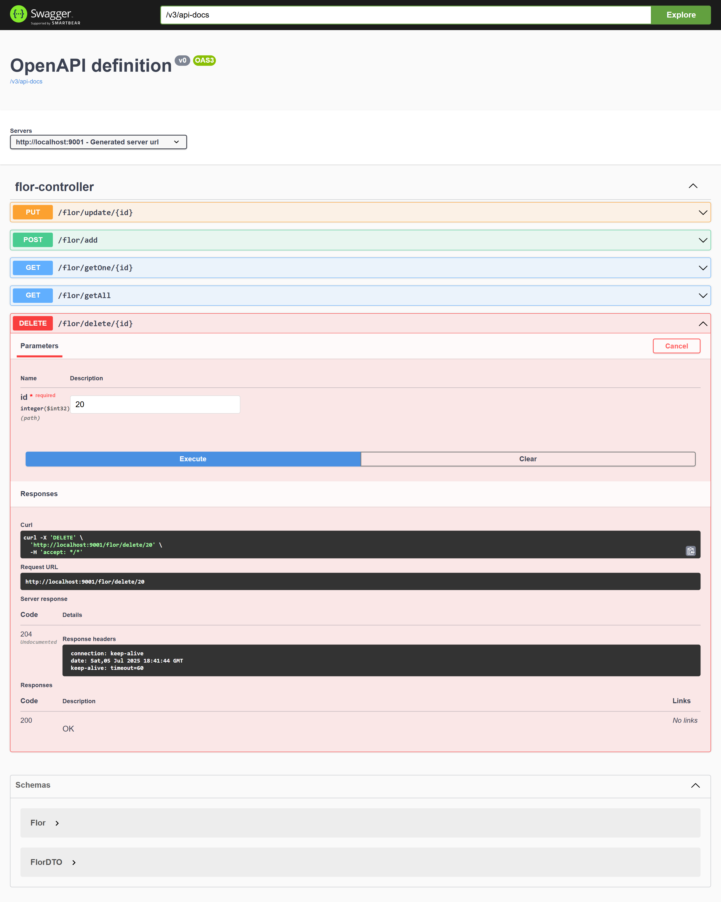
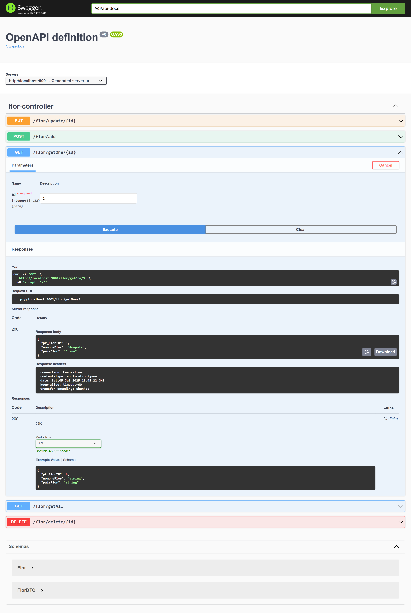
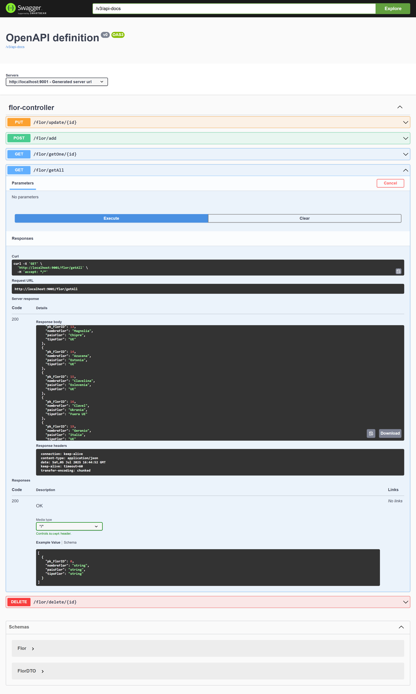
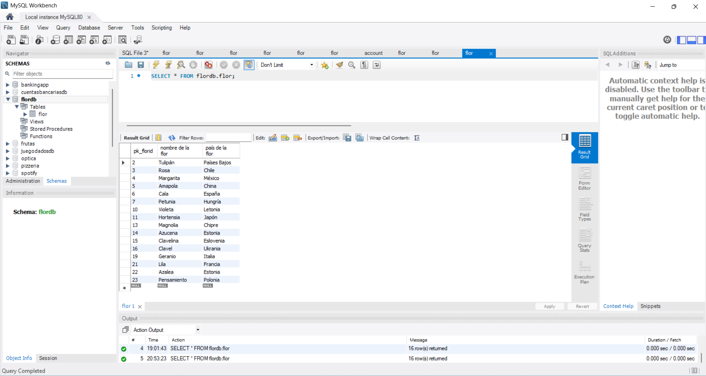

# 🚀 Sprint 5 · Tasca 1 · Nivel 2: CRUD con MySQL y Swagger (Spring Boot)

---

## 📄 Descripción

Esta aplicación es una API REST desarrollada con Spring Boot que permite realizar operaciones CRUD (crear, leer, actualizar y eliminar) sobre una base de datos MySQL de flores.  
La API utiliza Swagger para documentar los endpoints y facilitar su prueba e integración.

El modelo incluye una entidad `FlorEntity` y un DTO `FlorDTO`, que añade lógica adicional para determinar si una flor pertenece a un país de la Unión Europea (UE) o fuera de ella.

La arquitectura sigue el patrón MVC, separando responsabilidades entre controlador, servicio, repositorio y modelo de datos.

---

## 🎯 Objetivos

- Protocolo HTTP / REST.
- JPA.
- CRUD con Spring.
- MySQL.
- Swagger.

---

## 💻 Tecnologías utilizadas

- **Java 17**
- **Spring Boot** (última versión estable)
- **Maven** (gestor de dependencias)
- **IntelliJ IDEA**
- **MySQL Workbench**
- **Swagger**

---

## 📋 Requisitos

- Java JDK 17 instalado
- Maven instalado y configurado en el sistema
- IntelliJ IDEA o Eclipse
- MySQL Drivers
- Navegador web moderno (para acceder a la interfaz Swagger)

---

## 📁 Estructura del proyecto

```bash
S05T01N02BustamanteGabriela/
├── .idea/
├── .mvn/
├── screenshots/
│   ├── add_flor.png
│   ├── delete_flor.png
│   ├── get_all_flores.png
│   ├── get_one_flor.png
│   ├── mysql_flordb_table_after_update.png
│   └── update_flor.png
├── src/
│   ├── main/
│   │   ├── java/
│   │   │   └── cat/itacademy/barcelonactiva/bustamante/gabriela/s05/t01/n02/S05T01N02BustamanteGabriela/
│   │   │       ├── controller/
│   │   │       │   └── FlorController.java
│   │   │       ├── exception/
│   │   │       │   ├── FlorNotFoundException.java
│   │   │       │   └── GlobalExceptionHandler.java
│   │   │       ├── model/
│   │   │       │   ├── domain/
│   │   │       │   │   └── Flor.java
│   │   │       │   └── dto/
│   │   │       │       └── FlorDto.java
│   │   │       ├── repository/
│   │   │       │   └── FlorRepositorio.java
│   │   │       ├── services/
│   │   │       │   ├── FlorServicio.java
│   │   │       │   └── FlorServicioImpl.java
│   │   │       └── S05T01N02BustamanteGabrielaApplication.java
│   │   └── resources/
│   │       └── application.properties
│   └── test/
│       └── java/
│           └── cat/itacademy/barcelonactiva/bustamante/gabriela/s05/t01/n02/S05T01N02BustamanteGabriela/
│               └── S05T01N02BustamanteGabrielaApplicationTests.java
├── .gitignore
├── HELP.md
├── mvnw
├── mvnw.cmd
├── pom.xml
└── README.md
```

---

## 🚀 Funcionalidades de la API

- ➕ **POST** `/flor/add`  
  Crea una nueva flor.
- ✏️ **PUT** `/flor/update/{id}`  
  Actualiza una flor existente por su ID.
- ❌ **DELETE** `/flor/delete/{id}`  
  Elimina una flor por su ID.
- 🔍 **GET** `/flor/getOne/{id}`  
  Obtiene una flor por ID.
- 📋 **GET** `/flor/getAll`  
  Lista todas las flores.


---

## 🧰 Comandos Maven importantes

Desde la terminal, en el directorio del proyecto, se pueden ejecutar:

- `mvn compile` — Compila el proyecto
- `mvn package` — Empaqueta el proyecto
- `mvn clean` — Limpia los archivos compilados
- `mvn spring-boot:run` — Ejecuta la aplicación Spring Boot

---
## 🛠️ Instalación

1. Clona el repositorio:  
   `git clone https://github.com/GabyB73/Sprint5Tasca1Nivel2.git`
2. Abre el proyecto en IntelliJ o Eclipse.
3. Verifica que el archivo `pom.xml` está presente y correctamente configurado.
4. Asegúrate de tener una base de datos MySQL en ejecución.
5. Crea la base de datos si no existe (nombre según el `application.properties`).
6. Configura las credenciales de conexión a MySQL en el archivo `src/main/resources/application.properties`.
7. Ejecuta la aplicación:
   `mvn spring-boot:run`
   o desde el botón de "Run" en tu IDE.

---

## ▶️ Ejecución

### 📛 Documentación Swagger

Una vez ejecutada la aplicación (`mvn spring-boot:run` o desde el IDE), puedes acceder a la documentación interactiva en:

[http://localhost:9001/swagger-ui/index.html](http://localhost:9001/swagger-ui/index.html)
#### Endpoints disponibles

```bash
POST    http://localhost:9001/flor/add
PUT     http://localhost:9001/flor/update/{id}
DELETE  http://localhost:9001/flor/delete/{id}
GET     http://localhost:9001/flor/getOne/{id}
GET     http://localhost:9001/flor/getAll
```

Swagger permite explorar y probar todos los endpoints fácilmente, sin necesidad de herramientas externas.

---
### 📸 Capturas de pantalla

#### ➕ Añadir flor


#### ✏️ Actualizar flor


#### ❌ Eliminar flor


#### 🔍 Obtener una flor


#### 📋 Obtener todas las flores


#### 🧪 MySQL Workbench


---

## 📝 Notas técnicas

> **Nota sobre la documentación de Swagger**: En los métodos POST y PUT aparece el campo `pk_FlorID` en el cuerpo de la petición. Esto se debe a que el controlador recibe la entidad completa `Flor` en lugar de un DTO específico. Este campo es opcional y gestionado automáticamente por la aplicación.

---

## 🔗 Recursos utilizados

1- https://www.bezkoder.com/spring-boot-jpa-crud-rest-api/

2- https://www.youtube.com/watch?v=1BYxZCFjfyU

3- https://www.baeldung.com/spring-response-entity

---

## 🤝 Contribuciones

Este es un proyecto de práctica del bootcamp IT Academy.    
Las contribuciones no son necesarias, pero puedes hacer un fork o dejar comentarios si lo deseas.
  
---

## 👩‍💻 Autora

Desarrollado por **[Gabriela Bustamante](https://github.com/GabyB73)**  
Bootcamp de Desarrollo Java - IT Academy  

